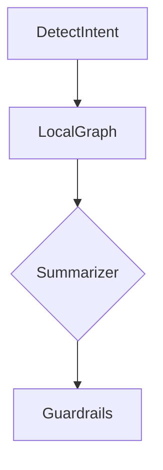

# Trace XAI: serialização de subgrafo/mermaid/Neo4j Bloom/GraphView

## Contexto e Problema
Ambientes regulados exigem explicabilidade: além da resposta, é preciso expor o caminho percorrido (modos, nós, escolhas, evidências) de forma auditável e visualizável. Sem um trace estruturado, é impossível reproduzir decisões, avaliar custos e justificar por que certas evidências foram usadas.

## Objetivo
Serializar, para cada consulta, um trace estruturado contendo: passos do DAG (nós SKGraph), métricas (latência/custos), entradas/saídas resumidas, subgrafo acessado (nós/arestas relevantes) e citações. Fornecer formatos: JSON (principal), Mermaid (opcional) e integração com Neo4j Bloom/GraphView.

## Atores e Escopo
- Usuário via `GET /v1/queries/{id}/trace`
- Serviços: `GraphExecutionContext`, `Telemetry/Observability`, `TraceSerializer`, `GraphStore`, `Guardrails`
- Dentro: coleta de eventos por nó, agregação do subgrafo e serialização
- Fora: UI específica (console) — porém os formatos são otimizados para consumo direto

## Pré-condições
- Hooks de telemetria ativados em todos os nós (`latency_ms`, `cost.tokens_in/out`, `provider/model`)
- Outputs de nós contendo `evidenceRefs` (`unit_id`/`community_id`) quando aplicável
- `traceId`/`queryId` propagados no `GraphContext`

## Entradas
- `queryId` e/ou `traceId`; parâmetros: `{format=json|mermaid, level=basic|full, limit_nodes}`
- Acesso a `GraphStore` para snapshot/subgrafo utilizado

## Fluxo (alto nível)
- Etapa 1: Durante execução, cada nó emite eventos/medidas para o coletor
- Etapa 2: Ao final (ou streaming), `TraceSerializer` monta estrutura consolidada
- Etapa 3: Subgrafo: agrega `Entity/Relation/Claim/TextUnit/Community` visitados (quando Local/Global)
- Etapa 4: Gera artefatos: JSON completo e Mermaid opcional; persiste e expõe via API
- Nós SKGraph: `RetryPolicyGraphNode`/`FunctionGraphNode` (com hooks) + `TraceSerializer` no epílogo

## Regras/Políticas e Guardrails
- Redação/mascaramento em payloads e citações conforme RBAC/ABAC e `sensitivity`
- Níveis de trace: `basic` (sem payloads sensíveis) vs `full` (para auditores)
- Limites de tamanho: `limit_nodes`, truncamento de textos e amostragem de evidências

## Saídas e Artefatos
- JSON principal (exemplo simplificado):
```json
{
  "queryId": "Q-2024-09-01-001",
  "mode": "local_graph",
  "steps": [
    {
      "node": "DetectIntent",
      "metrics": {"latency_ms": 35, "tokens_in": 30, "tokens_out": 5}
    },
    {
      "node": "LocalGraph",
      "params": {"k": 8, "depth": 2},
      "evidenceRefs": [
        {"type": "document", "doc_id": "D10", "unit_id": "U77", "page": 4, "heading": "Backup"},
        {"type": "av", "doc_id": "D55", "unit_id": "U220", "time_range": "00:12:40-00:13:05"}
      ],
      "metrics": {"latency_ms": 210, "tokens_in": 480, "tokens_out": 120}
    }
  ],
  "subgraph": {
    "nodes": [
      {"id": "E1", "label": "Entity", "type": "System", "name": "BackupService"},
      {"id": "C9", "label": "Claim", "text": "Backups semanais concluídos", "evidence": ["U77"]}
    ],
    "edges": [
      {"from": "E1", "to": "C9", "type": "MENTIONED_IN"}
    ]
  },
  "metrics": {"total_latency_ms": 520, "total_tokens_in": 700, "total_tokens_out": 240}
}
```

- Mermaid (opcional):


- Persistência: objeto JSON em storage (`artifacts/traces/{projectId}/{queryId}.json`) e referência em SQL (`Query.trace_ref`)

## Parâmetros e Ajustes
- `format`: `json|mermaid|both`
- `level`: `basic|full` (inclui/omite payloads e exemplos textuais)
- `limit_nodes`, `limit_evidences_per_step` para controlar tamanho

## Métricas e Critérios de Aceite
- Overhead ≤ 5% de latência mediana
- Trace reproduzível: reexecução determinística dos passos com mesmos inputs gera trace equivalente
- Conformidade: remoção/mascaramento consistente de PII nos artefatos

## Rastreabilidade
- Roadmap: seções 10 (Observabilidade, Qualidade e Avaliação) e 16 (RAG explicável)
- Roadmap técnico: seções 7 (Observabilidade), 18 (Contratos I/O), 6 (Endpoints – Observabilidade)

## Riscos e Considerações
- Vazamento de dados sensíveis em `full` → aplicar políticas e segregação de acesso
- Tamanho do trace em consultas longas → aplicar limites e amostragem
- Sincronia com o grafo em evolução → registrar `snapshotRef` ou `graphVersion`

## Exemplos
- `GET /v1/queries/Q-2024-09-01-001/trace?format=mermaid&level=basic`
- Resposta: string Mermaid; UI pode renderizar com GraphView/Neo4j Bloom

## Variantes e Extensões
- Streaming de eventos de trace (Server-Sent Events) para UI em tempo real
- Exportação de subgrafo para Neo4j via Cypher para inspeção avançada
